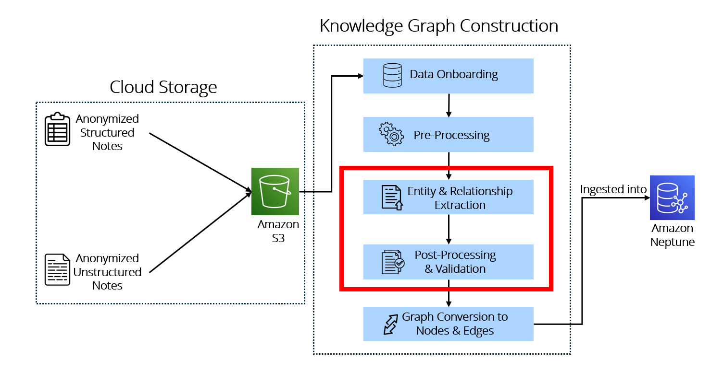

# Clinical Notes Extraction and Knowledge Graph Construction

## Overview
This project explores how free-text clinical notes can be transformed into structured Knowledge Graph, The workflow covers clinical entity extraction and clinical code mapping for downstream exploration and querying.

The documentation covers the following components:  
- [Clinical Entity Extraction](extraction.md)  
- [Clinical Code Mapping](code_mapping.md), which falls under Post-Processing and Validation

## Objective
The objective of this project is to build an automated pipeline to extract structured clinical entities from free-text notes and prepare them for Knowledge Graph construction.

## Running the Documentation 
To view the documentation locally:

1. Create and activate virtual environment.
2. Install the required packages `pip install mkdocs mkdocs-material mkdocstrings`.
3. Run `mkdocs serve`.
4. Open `http://127.0.0.8000/` to access the documentation.

