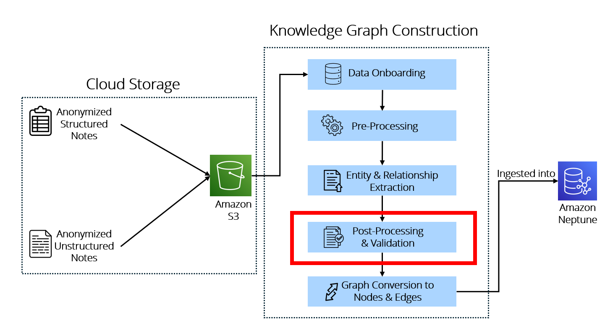

# Clinical Code Mapping
This stage maps extracted clinical entities to standardized medical ontologies to improve consistency, interoperability, and downstream querying.



Clinical code mapping standardizes extracted conditions and medications using recognised medical coding systems. This helps reduce variation in naming, resolve synonyms or abbreviations, and represent semantically similar entities in a consistent format. The mapped entities are then parsed for downstream graph construction and querying.


## Target Mapping Categories

### Conditions and Diagnoses
Extracted medical conditions are mapped to standard condition ontologies such as: <br>
- `ICD-10-AM` <br>
- `UMLS`

### Medications
Extracted medication names are mapped to standard medication terminologies such as: <br>
- `SNOMED CT` <br>
- `RxNorm`

#### Conditions
- `Type 2 Diabetes Mellitus` → `E11`
- `Hypertension` → `I10`

#### Medications
- `Cetirizine` → `775140005`
- `Metformin` → `776713006`

## Expected Output
After code mapping, extracted entities are enriched with standardized codes that can be used in downstream graph construction.


```
{
  "condition_name": "Type 2 Diabetes Mellitus",
  "mapped_ontology": "ICD-10-AM",
  "mapped_code": "E11"
}
```