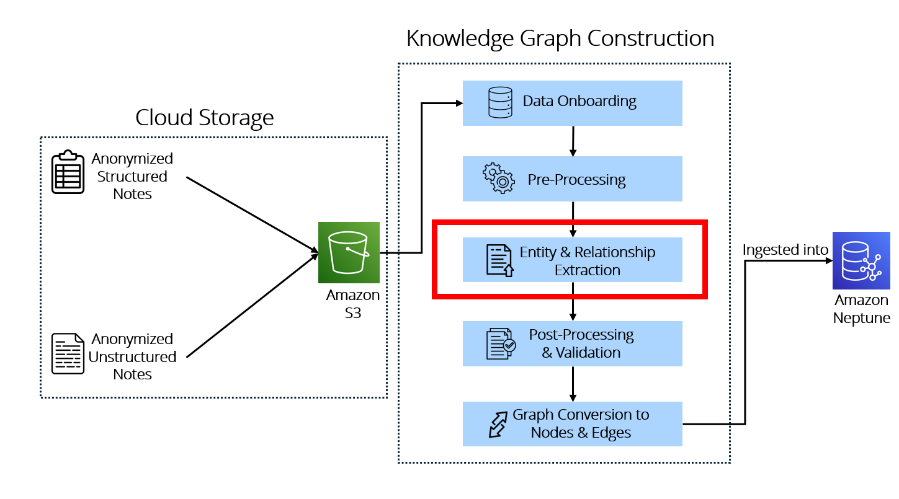

# Clinical Entity Extraction
This stage extracts structured clinical entities from free-text clinical notes.



## Input Data
10 out of 30 randomly selected clinical synopses, each containing approximately 3300 to 4000 characters, were sampled and evaluated in this extraction stage.

## Target Entities
The extraction step focuses on three groups of entities: patient demographics, medication details, and clinical conditions. All extracted entities, except medication start and end dates, are represented as nodes in the Knowledge Graph.

| Demographics | Medications | Conditions |
|---|---|---|
| `Patient ID`<br>`Name`<br>`Age`<br>`Gender`<br>`Ethnicity` | `Medication ID`<br>`Medication Name`<br>`Start Date`<br>`End Date` | `Medical Conditions` |


## LLM Model Utilised
The extraction pipeline uses the locally hosted Ollama model `medgemma-27b-text-it-Q4_K_S.gguf`. Both frameworks used the same locally hosted LLM to ensure a fair comparison of processing time and extraction accuracy.

## Frameworks Explored

### LangExtract
LangExtract is an open-source framework developed by Google for extracting structured information from unstructured text using large language models. LangExtract is designed for information extraction tasks where the goal is to identify specific entities, attributes, or relationships from natural language text and return them in a structured format.

In this project, LangExtract was explored as one of the extraction frameworks for parsing free-text clinical synopses into predefined target entities, including patient demographics, medication details, and medical conditions. The framework uses few-shot prompting to guide the model towards the desired extraction pattern, and it supports chunking strategies to process longer inputs in manageable segments. This makes it suitable for clinical notes where relevant information may be distributed across multiple parts of a document.

### LangChain
LangChain is an open-source framework for building LLM-powered pipelines and custom extraction workflows. It provides modular components that allow users to define prompts, invoke language models, structure outputs, and chain multiple processing steps together within a larger pipeline.

In this project, LangChain was explored as an alternative extraction approach for the same clinical entity extraction task. Its flexibility makes it useful for designing custom workflows tailored to project-specific schemas and output formats. This was particularly relevant for structuring extracted entities into a consistent format for downstream post-processing, clinical code mapping, and graph conversion. Compared with LangExtract, LangChain provided more workflow flexibility and faster processing, but the observed extraction quality was lower on the sampled clinical synopses.


| Metric | LangExtract | LangChain|
| :------- | :------: | -------: |
| Accuracy    |  98%  |   75%  |
| Processing Time    |  ~ 6 mins   |  ~4 mins    |

LangExtract showed stronger observed extraction accuracy, while LangChain achieved faster processing time.
As extraction quality was prioritized in this project, LangExtract was selected for the final workflow.

## Output Format
The extracted output is first stored in structured JSON format, before undergoing post-processing and conversion into graph-ready CSV files. A simplified example is shown below:

```
[
  {
    "class": "Patient ID",
    "text": "P84271"
  },
  {
    "class": "Patient Name",
    "text": "Abdul Rahman Bin Salleh"
  },
  {
    "class": "Patient Age",
    "text": "72"
  },
  {
    "class": "Patient Gender",
    "text": "Male"
  },
  {
    "class": "Patient Ethnicity",
    "text": "Malay"
  },
  {
    "class": "Medication ID prescribed to patient",
    "text": "M228"
  },
  {
    "class": "Medication Name prescribed to patient",
    "text": "Metformin"
  },
  {
    "class": "Start Date of medication course",
    "text": "21/06/2019"
  },
  {
    "class": "End Date of medication course",
    "text": "10/03/2023"
  },
  {
    "class": "Medical Condition(s) patient suffered from",
    "text": "Type 2 Diabetes Mellitus (T2DM)"
  },
  {
    "class": "Medication ID prescribed to patient",
    "text": "M409"
  },
  {
    "class": "Medication Name prescribed to patient",
    "text": "Sitagliptin"
  },
  {
    "class": "Start Date of medication course",
    "text": "11/03/2023"
  },
  {
    "class": "End Date of medication course",
    "text": "11/03/2026"
  },
  {
    "class": "Medical Condition(s) patient suffered from",
    "text": "Type 2 Diabetes Mellitus (T2DM)"
  }
]
```